# Ordinals Art Marketplace - Application Sitemap

This document provides a visual representation of the complete application structure, showing all routes, pages, and navigation paths.

## Visual Sitemap

```mermaid
graph TD
    Home["/Home<br/>Landing Page<br/>- Wallet Connection<br/>- Role Selection"] --> Artist["/artist<br/>Artist Dashboard"]
    Home --> Gallery["/gallery<br/>Gallery Dashboard"]
    Home --> Benefactor["/benefactor<br/>Benefactor Dashboard"]
    Home --> Marketplace["/marketplace<br/>NFT Marketplace"]
    Home --> Governance["/governance<br/>Governance Portal"]
    Home --> Reputation["/reputation<br/>Reputation Center"]
    Home --> Community["/community<br/>Community Hub"]
    Home --> Showcase["/showcase<br/>Art Gallery"]

    %% Artist Routes
    Artist --> ArtistOverview["Overview Tab<br/>- Stats & Metrics<br/>- Recent Activity"]
    Artist --> ArtistProfile["Profile Tab<br/>- Edit Profile<br/>- Portfolio"]
    Artist --> CreateOrdinal["/artist/create<br/>Create Ordinal<br/>- Mint on Bitcoin<br/>- Set Metadata"]
    Artist --> MyArtworks["My Artworks Tab<br/>- List Creations<br/>- Manage NFTs"]
    Artist --> ArtistCollabs["Collaborations Tab<br/>- Joint Projects<br/>- Revenue Sharing"]
    Artist --> ArtistGov["Governance Tab<br/>- Voting Power<br/>- Proposals"]
    Artist --> ChainSync["Chain Sync Tab<br/>- Oracle Status<br/>- Cross-chain Data"]
    
    ArtistCollabs --> CollabDetail["/artist/collaborations/[id]<br/>Collaboration Details<br/>- Milestones<br/>- Participants"]

    %% Gallery Routes
    Gallery --> GalleryCreate["/gallery/create<br/>Create Gallery<br/>- Deploy Contract<br/>- Set Parameters"]
    Gallery --> GalleryDash["/gallery/dashboard<br/>Gallery Management"]
    
    GalleryDash --> GalleryOverview["Overview Tab<br/>- Gallery Stats<br/>- Revenue"]
    GalleryDash --> Collections["Collections Tab<br/>- Curate Works<br/>- Manage Sets"]
    GalleryDash --> Exhibitions["Exhibitions Tab<br/>- Virtual Shows<br/>- Events"]
    GalleryDash --> GalleryCollabs["Collaborations Tab<br/>- Artist Partnerships"]
    GalleryDash --> ArtistNetwork["Artists Network Tab<br/>- Discover Artists<br/>- Send Invites"]

    %% Benefactor Routes
    Benefactor --> BenefactorDash["/benefactor/dashboard<br/>Liquidity Dashboard<br/>- Pool Stats<br/>- Rewards<br/>- Governance Power"]

    %% Marketplace Routes
    Marketplace --> MarketBrowse["Browse View<br/>- Grid/List Toggle<br/>- Filters & Search<br/>- Categories"]
    Marketplace --> ArtworkDetail["/marketplace/artwork/[id]<br/>Artwork Detail<br/>- Bidding<br/>- Purchase<br/>- Artist Info<br/>- Chat"]

    %% Community Routes
    Community --> Forums["/community/forums<br/>Forum List<br/>- Topics<br/>- Categories"]
    Forums --> CreateTopic["/community/forums/create<br/>New Topic<br/>- Title & Content<br/>- Tags"]
    Forums --> TopicView["/community/forums/topic/[id]<br/>Discussion Thread<br/>- Comments<br/>- Likes"]

    %% Profile Routes
    Home --> Profile["/profile/[id]<br/>User Profile<br/>- Portfolio<br/>- Activity<br/>- Reputation"]
    Artist --> Profile
    Gallery --> Profile
    Benefactor --> Profile

    %% Governance Details
    Governance --> CreateProposal["Create Proposal<br/>- Title & Description<br/>- Domain Selection<br/>- Parameters"]
    Governance --> VoteProposal["Vote on Proposals<br/>- Quadratic Voting<br/>- Domain Weights<br/>- Veto Options"]
    Governance --> ProposalHistory["Proposal History<br/>- Past Decisions<br/>- Execution Status"]

    %% Reputation Details
    Reputation --> RepDashboard["Reputation Dashboard<br/>- Current Score<br/>- Decay Timeline<br/>- Domain Breakdown"]
    Reputation --> Achievements["Achievements<br/>- Unlocked Badges<br/>- Progress Tracking"]
    Reputation --> Leaderboard["Leaderboard<br/>- Top Contributors<br/>- Domain Rankings"]

    %% Style
    classDef primary fill:#f9f,stroke:#333,stroke-width:4px
    classDef secondary fill:#bbf,stroke:#333,stroke-width:2px
    classDef tertiary fill:#bfb,stroke:#333,stroke-width:2px
    
    class Home primary
    class Artist,Gallery,Benefactor,Marketplace secondary
    class Governance,Reputation,Community,Showcase tertiary
```

## Route Structure Summary

### Main Routes
- `/` - Home/Landing Page
- `/artist` - Artist Dashboard
- `/gallery` - Gallery Dashboard  
- `/benefactor` - Benefactor Dashboard
- `/marketplace` - NFT Marketplace
- `/governance` - Governance Portal
- `/reputation` - Reputation Center
- `/community` - Community Hub
- `/showcase` - Art Gallery Showcase
- `/profile/[id]` - User Profiles

### Artist Routes
- `/artist/create` - Create New Ordinal
- `/artist/collaborations/[id]` - Collaboration Details

### Gallery Routes
- `/gallery/create` - Create New Gallery
- `/gallery/dashboard` - Gallery Management

### Marketplace Routes
- `/marketplace/artwork/[id]` - Artwork Detail Page

### Community Routes
- `/community/forums` - Forum Listing
- `/community/forums/create` - Create New Topic
- `/community/forums/topic/[id]` - Topic Discussion Thread

## Navigation Flow

1. **Entry Point**: All users start at the home page
2. **Authentication**: Connect wallets (MetaMask for Ethereum, Xverse for Bitcoin)
3. **Role Selection**: Choose between Artist, Gallery, Benefactor, or Marketplace
4. **Role-Specific Dashboards**: Navigate to specialized interfaces based on selected role
5. **Cross-Platform Features**: Access governance, reputation, and community features from any role

## Technical Implementation

- **Frontend**: Next.js 14 with App Router
- **Routing**: File-based routing with dynamic segments
- **State Management**: React Context for wallet and user state
- **API Integration**: RESTful backend with WebSocket support for real-time features